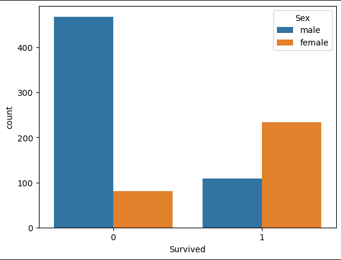
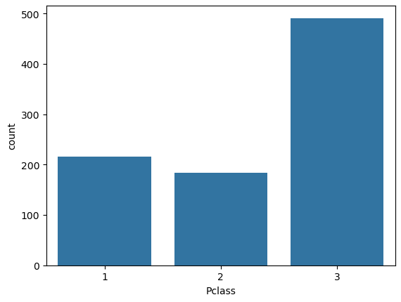
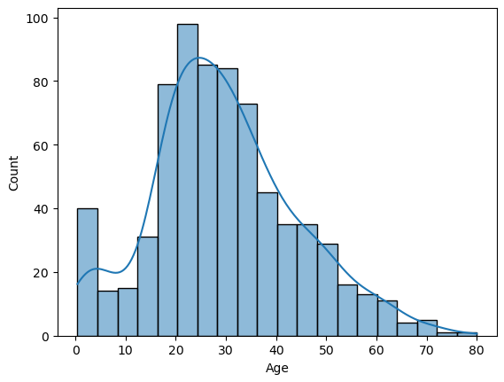
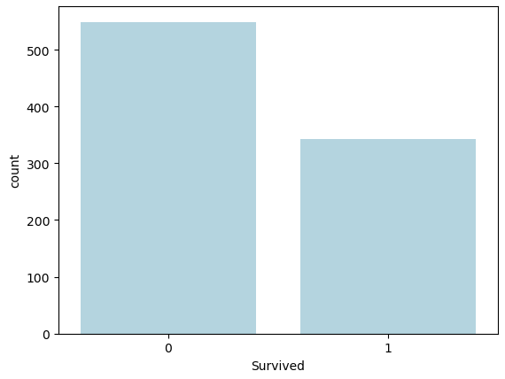

# Titanic Survival Prediction 🚢

## 📌 Project Overview
This project predicts whether a passenger survived the Titanic disaster using machine learning.  
It demonstrates a complete data science workflow including data cleaning, exploratory data analysis (EDA), feature engineering, model building, and evaluation.

---

## 🎯 Problem Statement
Given passenger details such as age, gender, class, and fare, predict whether the passenger survived the Titanic disaster.

This is a **binary classification problem**.

---

## 📊 Dataset
- Source: Titanic dataset
- Rows: 891
- Target Variable: `Survived` (0 = No, 1 = Yes)

---

## 🔍 Exploratory Data Analysis (EDA)
Key insights from EDA:
- Female passengers had a significantly higher survival rate.
- Passengers in higher classes (1st class) were more likely to survive.
- Age distribution was right-skewed.
- Missing values were present in Age, Cabin, and Embarked columns.

---

## 🧹 Data Cleaning
Steps performed:
- Filled missing `Age` values using median.
- Filled missing `Embarked` values using mode.
- Dropped `Cabin` column due to excessive missing values.
- Removed irrelevant text columns (`Name`, `Ticket`).

---

## 🛠 Feature Engineering
- Encoded `Sex` using binary encoding.
- Applied one-hot encoding to `Embarked` and `Pclass`.
- Prepared feature matrix and target variable.

---

## 🤖 Model Building
- Algorithm used: **Logistic Regression**
- Data split: 80% training, 20% testing
- `max_iter` set to 1000 to ensure convergence.

---

## 📈 Model Evaluation

### Confusion Matrix

[89 16]
[21 53]

## The model correctly identified 89 non-survivors and 53 survivors.

## It misclassified 16 non-survivors as survivors and missed 21 actual survivors.

## The model performs better at predicting non-survival than survival.

|             | Predicted No | Predicted Yes |
|-------------|--------------|---------------|
| Actual No   | 89           | 16            |
| Actual Yes  | 21           | 53            |

## 🚀 How to Run

1. Clone the repo  
2. Install dependencies  
   `pip install -r requirements.txt`  
3. Open `notebooks/titanic_end_to_end.ipynb`  
4. Run cells in order

## Model result

| Metric    | Score |
| --------- | ----- |
| Accuracy  | 0.79  |
| Precision | 0.77  |
| Recall    | 0.72  |

### Survival by Gender

**Insight:**
- A significantly higher number of **female passengers survived** compared to males.
- Most **male passengers did not survive**, indicating gender was a strong factor in survival.

### Passenger Class Distribution

**Insight:**
- Most passengers belonged to **3rd class**, followed by 1st and 2nd class.
- This imbalance suggests socio-economic class may influence survival probability.

### Age Distribution

**Insight:**
- The age distribution is **right-skewed**, with most passengers between **20–40 years**.
- Fewer elderly passengers were present, creating a long right tail in the distribution.

### Overall Survival Count

**Insight:**
- The number of passengers who **did not survive** is higher than those who survived.
- This indicates **class imbalance**, which should be considered during model evaluation.
